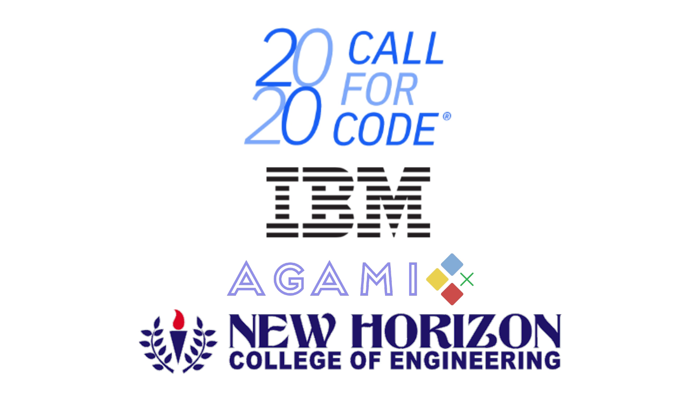
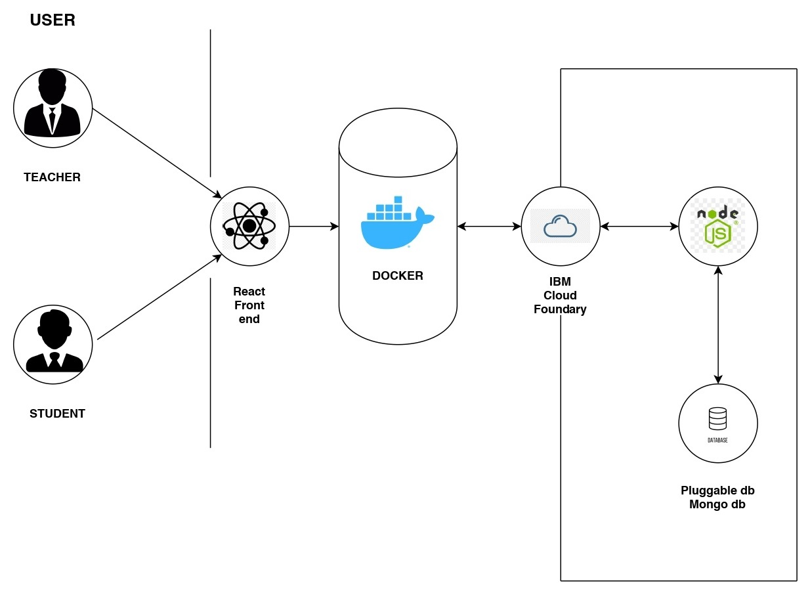
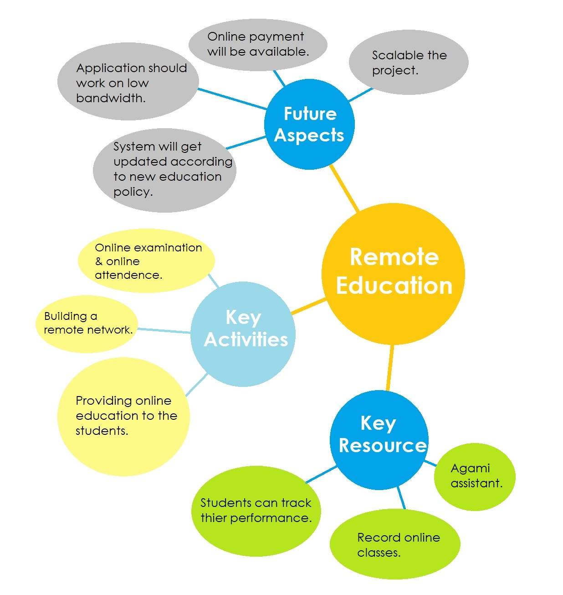
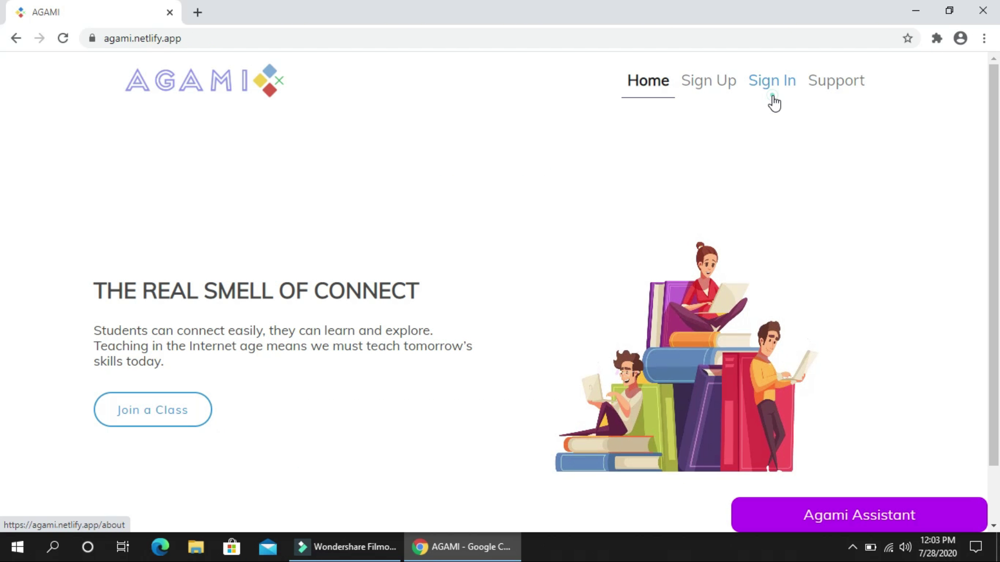
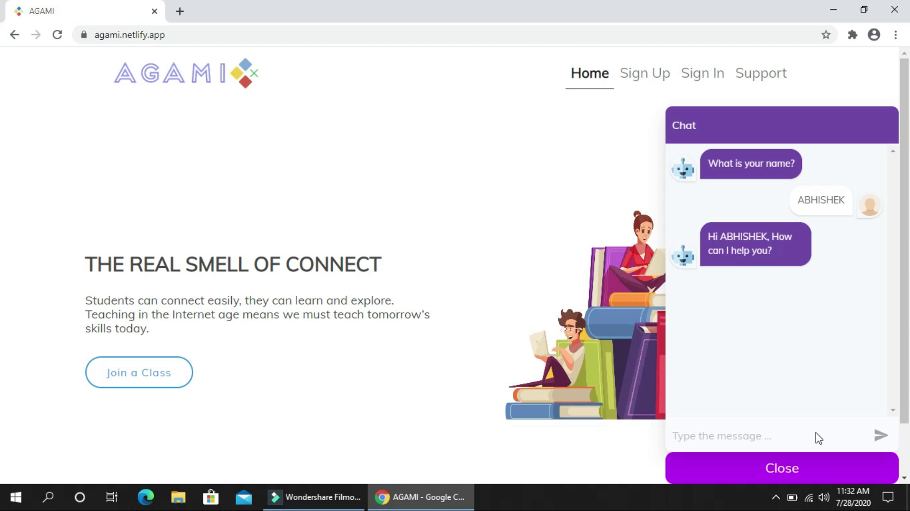
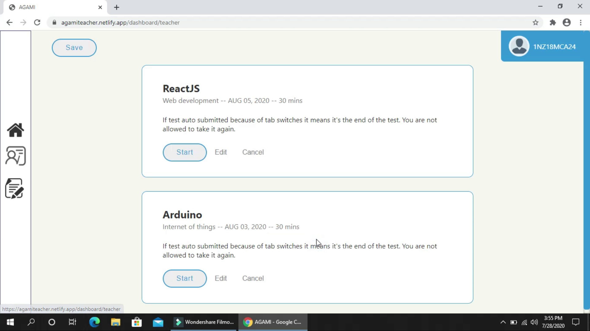
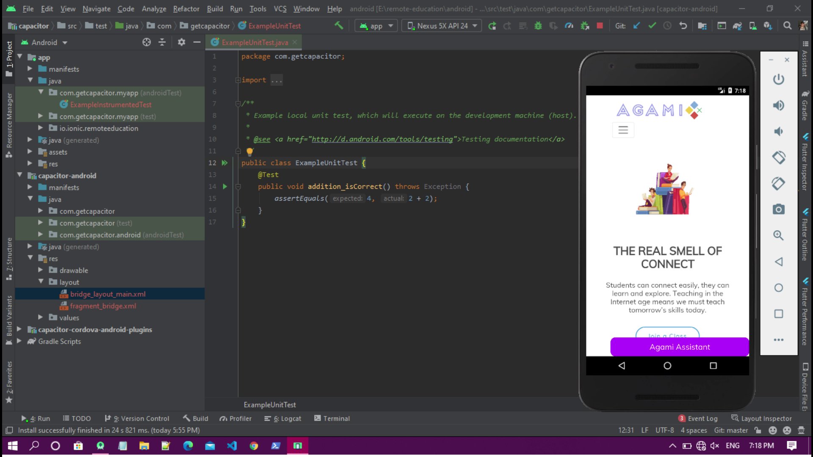
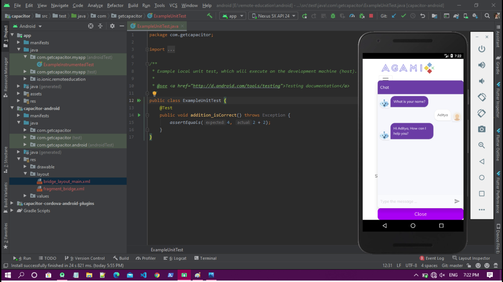

# CALL FOR CODE - REMOTE EDUCATION - TEAM AGAMI

### Demo video link
https://youtu.be/HOZ7BWv2JAg

## Real world problem

##### Due to this Covid-19 pandemic, we all are facing problems in our day to day life. Especially, the impact of Covid-19 is highly on education system. Many students and teachers are not able to connect which is leading a bad impact on education system. Keeping this problem in mind, we have created a web application and mobile application through which teachers can take their classes online effectively as well as students can attend their online classes.

### Technology used

##### •	In front-end, we have used ReactJS framework and middleware technologies that are IBM Cloud Foundry which is used to host the website.
##### •	We have also used Docker container that encapsulates your application, runtime and dependencies.
##### •	In back-end, we have used NodeJS for client-side and MongoDB for the database. 
##### •	Using NodeJS, we can access local file system which is not allowed in the browser and it also exposes security vulnerabilities. 
##### •	We have used WebRTC technology for live streaming classes. This technology provides real-time communication capabilities to the application that works on top of an open standard.
##### •	It supports video, voice, and generic data to be sent between peers, allowing developers to build powerful voice and video communication solutions.

### Solution

##### In this pandemic, students are facing major problems due to lack of regular classes. So, keeping this problem in mind, we have developed a web and mobile application where teachers can easily take online classes and students can attend it. This application supports some useful features like teachers can take online attendance as well as online exam which would be very helpful for the students and all these features are on single platform. This application is system independent which can run on any device. We are using IBM Cloud technologies which are secure and much faster. It also supports online classes and recording feature for those students who are not able to attend live classes due to some reasons. Those students can refer those online classes.

### Explanation that why it’s better than existing system

##### In existing system, features like online attendance and online exam is not available on single platform, teachers have to create separate attendance form for attendance and exam form for exam. Our system makes up these shortcomings. It provides features like online attendance and online exam on single platform which makes our system very effective. Teachers need not to create any separate form. Our system can work on low network bandwidth whereas in existing system connection gets disconnect when the network strength gets weaker. This system is also available in mobile application as well as desktop application which provide very much flexibility to the users. Since, we are using ReactJS framework so that our system’s GUI is user-friendly. There is also a Chat Bot feature which is called Agami Assistant which informs the students regarding their class timings and exam timings which have been scheduled by the teachers.

## Screenshots

### Home Page

## Agami Assistant (Chatbot)

## Student Online Test Dashboard

## Student Test Page

## Screenshots of android app

### Demo video link
https://youtu.be/HOZ7BWv2JAg
